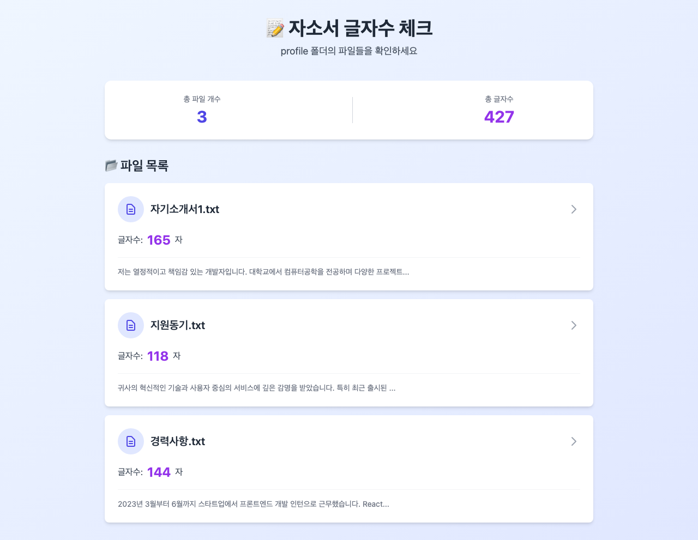
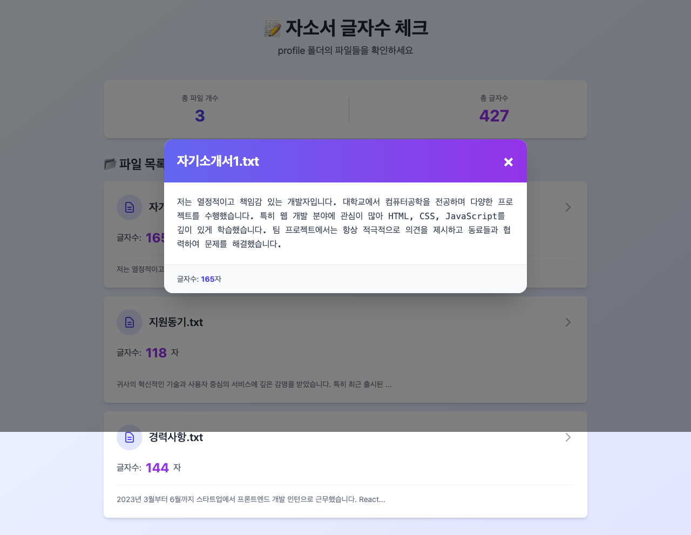

# Agent Work Log

이 파일은 AI 에이전트들의 작업 기록입니다. 새로운 에이전트는 작업 전 이 파일을 참고하세요.

---
## 2026-01-24 13:17:06 - Vercel Agent 👤

**티켓:** 자소서 글자수 체크앱 배포하기
**상태:** ✅ 성공

### 작업 요약
- 이제 Vercel 배포를 위한 최적의 설정을 적용하여 배포를 시작하겠습니다.좋습니다! Vercel에 이미 로그인되어 있습니다 (사용자: `season1zeepapa-1399`). 이제 `vercel.json` 설정 파일을 생성하겠습니다.완벽합니다! `vercel.json` 설정 파일을 생성했습니다. 이 설정은:
- - `vercel.json`: 정적 파일 호스팅 최적화 설정
- - `vercel.json` 생성 - 정적 파일 호스팅에 최적화된 설정
- - ✅ `vercel.json` - Vercel 배포 설정 파일

### 스크린샷

---

## 2026-01-24 13:15:24 - Interaction Developer (JavaScript) 👤

**티켓:** 자소서 글자수 체크 앱 기능 구현 완성하기
**상태:** ✅ 성공

### 작업 요약
- **client.js**에서 구현된 주요 기능:
- - `loadFiles()`: 파일 자동 로딩 (fetch API 사용)
- - `renderFileList()`: 파일 카드 동적 생성
- - `updateStats()`: 통계 자동 계산 및 표시
- - `showFileContent()`: 모달 팝업 표시

### 스크린샷

---

## 2026-01-24 13:13:45 - UI/UX Architect (HTML & CSS) 👤

**티켓:** 자소서 글자수 체크 앱 화면 만들기
**상태:** ✅ 성공

### 작업 요약
- I'll help you create a user-friendly interface for a character count checker app. Let me start by understanding the project structure and then build the HTML page.profile 폴더가 없네요. 먼저 예시 파일들을 만들어서 테스트할 수 있도록 하겠습니다. 그리고 나서 화면을 구현할게요.좋아요! 이제 index.html 파일을 만들겠습니다. 초보자분들을 위해 전체 구조를 먼저 설명드릴게요:
- 우리가 만들 화면은 이렇게 구성됩니다:
- 1. **HTML 뼈대**: 페이지의 기본 구조 (제목, 파일 목록 영역 등)
- 2. **Tailwind CSS**: 예쁜 디자인을 위한 스타일 클래스들
- 3. **JavaScript 연결**: client.js 파일을 연결해서 실제 파일을 읽고 글자수를 계산하는 기능 추가

---
